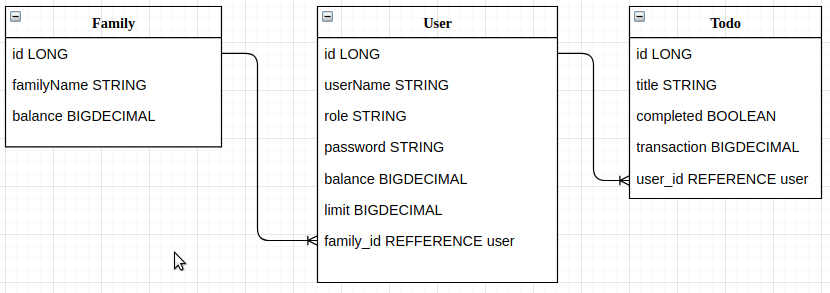

## Family Budget
The main purpose of the application is to document and manage the costs of both an individual family member and the whole family as a whole.
### Description of the project
1. The project was implemented using the Java Spring framework.
2. The following materials were used:
   1. spring-boot-starter-data-jpa
   2. spring-boot-starter-web
   3. spring-boot-devtools
   4. lombok
   5. postgresql
3. Gradle chose the compilation environment because the compilation speed is faster than Maven's.
4. Application connection diagram:

5. Implemented: 
   1. CRUD treatment of the user
   2. CRUD treatment of the family
   3. Creation of a Todo task (implementation of accounting for the withdrawal / replenishment of budget funds)
6. Implemented work with exceptions
7. Problems I encountered: insufficient knowledge in the field of Authorization / Authentication - JWT, OAuth.

### Start-up instructions
1. To run the application, you need to create a database in the Postgres environment with the following parameters:
   1. port: 5432
   2. DB name: dbBudget
   3. username: postgres
   4. password: 123
2. The application creates the necessary tables and dependencies on its own.
3. The list of requests for testing all calls is presented in the file:
   [familyBudget.postman_collection.json](familyBudget.postman_collection.json)
